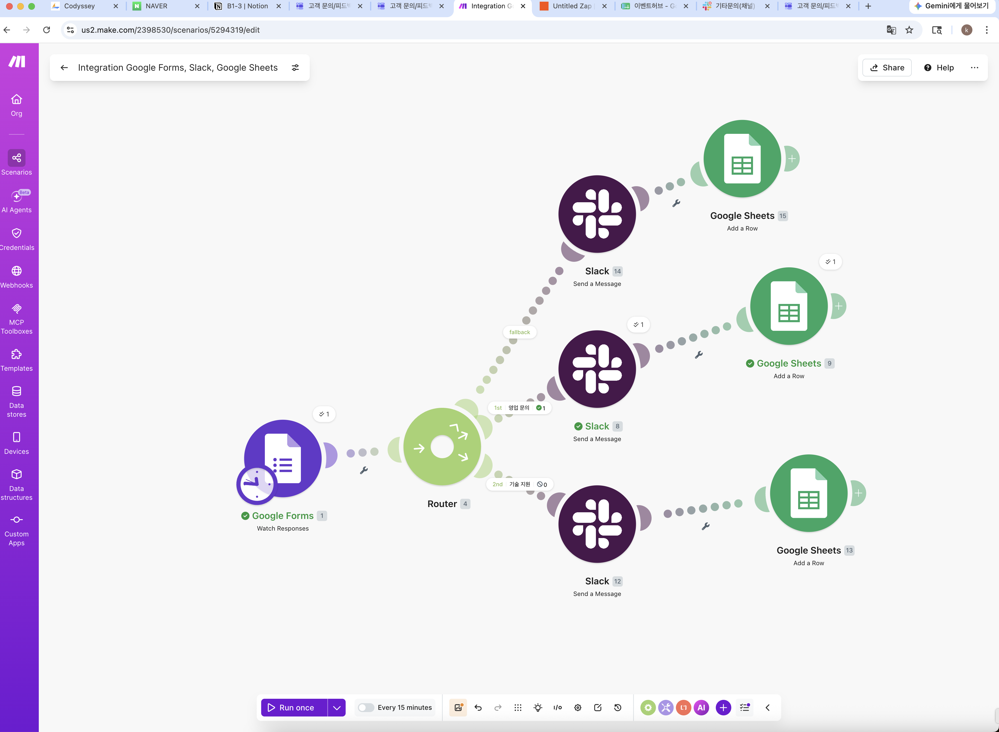

# B1-3

# **[프로젝트 1] 자동화 도구 비교 구현 (Make vs Zapier)**

## [1] 비교 분석 보고서

### **1. 사용한 도구 이름**

- **자동화 허브 도구:** Make, Zapier
- **연동 서비스:** Google Forms, Google Sheets, Slack

### **2. 구현 과정 요약**

두 도구 모두 **"Google Form 제출(Trigger) → 문의 유형별 조건 분기 → Slack 알림 및 Google Sheets 행 추가(Actions)"**의 동일한 워크플로우 구조로 구현했습니다.

- **공통 준비:** 문의 유형(영업/기술/기타)을 포함한 Google Form과, 각 유형별 데이터를 저장할 Google Sheets 탭 및 Slack 채널을 생성했습니다.
- **Make 구현:** `Router` 모듈을 사용하여 '문의 유형' 값에 따라 3개 경로로 분기시킨 후, 각 경로에 `Slack`과 `Google Sheets` 모듈을 연결했습니다.
- **Zapier 구현:** `Paths` 기능을 사용하여 동일한 조건으로 3개의 경로(Path A, B, C)를 설정하고, 각 경로 내부에 `Slack`과 `Google Sheets` Action을 추가했습니다.
- **테스트:** 모든 유형의 문의를 직접 제출하여, 각 경로가 의도대로 정상 동작하는지 검증을 완료했습니다.

#### **1) Make 구현 내용**

- **Trigger:** `Google Forms` - Watch Responses (새로운 양식 제출 감지)
- **Router (조건 분기):** '문의 유형' 필드 값을 기준으로 3개 경로로 분기
    - **경로 1:** '영업문의'일 경우
    - **경로 2:** '기술지원'일 경우
    - **경로 3 (Fallback):** 그 외 모든 경우 ('기타문의')
- **Action 1:** `Slack` - Send a Message (각 경로에 맞는 채널로 알림 발송)
- **Action 2:** `Google Sheets` - Add a Row (각 경로에 맞는 시트에 데이터 추가)

---

#### **2). Zapier 구현 내용**

- **Trigger:** `Google Forms` - New Form Response (새로운 양식 제출 감지)
- **Paths (조건 분기):** '문의 유형' 필드 값을 기준으로 3개의 Path로 분기
    - **Path A (영업문의):** '문의 유형'이 '영업문의'와 정확히 일치할 경우
    - **Path B (기술지원):** '문의 유형'이 '기술지원'과 정확히 일치할 경우
    - **Path C (기타문의):** '문의 유형'이 '영업문의'도 아니고 '기술지원'도 아닐 경우
- **Action (각 Path 내부):**
    1. `Slack` - Send Channel Message (각 경로에 맞는 채널로 알림 발송)
    2. `Google Sheets` - Create Spreadsheet Row (각 경로에 맞는 시트에 데이터 추가)

### **3. 비교 분석 (5개 항목)**

| 비교 항목 | Make (Integromat) | Zapier |
| --- | --- | --- |
| **1. UI/UX** | 전체 워크플로우를 한눈에 보는 **시각적 노드(모듈) 기반**. 자유로운 배치가 가능. | 위에서 아래로 흐르는 **단계별 리스트 기반**. 절차가 명확하고 직관적. |
| **2. 설정 난이도** | 초기 학습 곡선이 약간 존재. 데이터 구조(Bundle)에 대한 이해가 필요. | 매우 직관적이고 쉬움. 가이드가 잘 되어 있어 초보자에게 친화적. |
| **3. 무료 플랜 범위** | **월 1,000 Operations**. 시나리오 개수 제한 없음. **조건 분기(Router) 무료.** | **월 100 Tasks**. Zap 5개 제한. **조건 분기(Paths)는 유료 플랜부터 지원.** |
| **4. 연동 서비스 범위** | 두 도구 모두 수천 개의 앱을 지원하여 매우 광범위함. 특정 앱의 세부 기능에서 약간의 차이가 존재. |  |
| **5. 실행 로그 확인** | 실행 히스토리에서 각 모듈별 입출력 데이터를 상세하게 확인 가능. 디버깅에 유리. | Zap History에서 각 Task의 성공/실패 여부와 간단한 데이터를 확인할 수 있음. |

### **4. 각 도구의 장단점 정리**

- **Make**
    - **장점:** 강력한 무료 플랜 (조건 분기 무료), 시각적 직관성, 높은 자유도
    - **단점:** Zapier에 비해 초기 설정이 다소 복잡하게 느껴질 수 있음
- **Zapier**
    - **장점:** 압도적인 사용 편의성, 매우 빠른 설정 속도
    - **단점:** 제한적인 무료 플랜 (핵심 기능인 Paths가 유료)

### **5. 어떤 상황에 적합한지**

단순하고 빠르게 1:1 연결 자동화를 만들 때는 **Zapier**가 편리합니다. 하지만 이번 프로젝트처럼 **여러 조건으로 분기하는 복잡한 워크플로우를 구축**하거나, **비용 효율성**을 중요하게 생각하는 개인 및 소규모 팀에게는 핵심 기능을 무료로 제공하는 **Make가 훨씬 더 합리적이고 강력한 선택**이라고 생각합니다.

### **[2].워크플로우 구성 화면 캡쳐 (전체 구조 Make & Zapier)**

### [3].실행 결과 화면 캡쳐(Slack & Google sheet 의 영업문의, 기술지원, 기타문의)

### 

# **[프로젝트 2] 자유 주제 자동화 설계 및 구현**

### **[1]. 자동화할 반복 업무 정의**

- 고객 문의가 구글 폼으로 접수될 때마다 담당자가 수동으로 내용을 확인하고, 문의 유형에 맞는 슬랙 채널에 알림 메시지를 복사/붙여넣기 한 뒤, 구글 시트의 각 탭에 문의 내용을 다시 정리하는 반복적인 작업.

### **[2]. 자동화 도구 선정 및 이유**

- **선정 도구:** **Make**
- **선정 이유:**
    1. **핵심 기능 무료 제공:** 프로젝트의 필수 요건인 '3갈래 조건 분기(Router)' 기능을 무료 플랜에서 완벽하게 지원합니다. (Zapier는 유료)
    2. **비용 효율성:** 월 1,000회라는 넉넉한 무료 작업량을 제공하여 실제 업무에 적용해도 추가 비용 발생 가능성이 낮습니다.
    3. **유지보수 편의성:** 시각적인 UI 덕분에 추후 문의 유형이 추가되거나 변경될 때 워크플로우를 수정하고 관리하기 용이합니다.
    4. **확장성:** 추후에 이메일 알림을 추가하거나, 다른 서비스로 데이터를 보내는 등 기능을 확장하기에 용이한 구조를 가지고 있습니다.

### **[3]. 워크플로우 흐름 설명(Make)**

이 자동화는 **"① 새로운 Google Form 응답이 제출되면(Trigger) → ② '문의 유형' 값에 따라 3개의 경로로 분기하고(Router) → ③ 각 경로에 지정된 Slack 채널 알림 및 Google Sheets 탭에 내용을 자동으로 기록(Actions)한다"** 는 흐름으로 동작합니다.

1. **Trigger:** `Google Forms` - Watch Responses (새로운 양식 제출 감지)
- **Router (조건 분기):** '문의 유형' 필드 값을 기준으로 3개 경로로 분기
    - **경로 1:** '영업문의'일 경우
    - **경로 2:** '기술지원'일 경우
    - **경로 3 (Fallback):** 그 외 모든 경우 ('기타문의')
- **Action 1:** `Slack` - Send a Message (각 경로에 맞는 채널로 알림 발송)
- **Action 2:** `Google Sheets` - Add a Row (각 경로에 맞는 시트에 데이터 추가)

### [4].구현화면 캡쳐

- **Make:**
    - **Router의 필터 설정 화면:**
    - **Google Sheets 모듈 설정 화면:** **Google Form의 데이터가 시트의 각 열에 매핑(연결)된 모습**.

### [5].실행결과 화면 캡쳐

**Google Sheets 화면:**

- *'영업문의', '기술지원', '기타문의' 각 탭(시트)**에 테스트 데이터가 **한 줄씩 추가된 모습**

